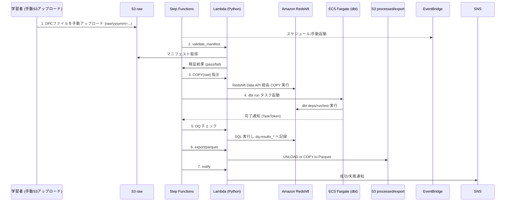

# DPC 学習基盤 全体アーキテクチャ設計（AWS）

## 目的
DPC データ学習基盤のコンポーネント構成、データフロー、およびセキュリティ境界を明確にし、関係者間の共通理解を形成する。

## 想定ユーザーとワークロード
- **データエンジニア**: DPC ファイルの取込・変換・公開ワークロードを実装・運用する。
- **アナリスト / 研究者**: mart 層を Redshift / QuickSight から参照し、統計分析と可視化を行う。
- **プラットフォーム管理者**: 権限管理、セキュリティ設定、運用監視を担当する。

## コンポーネント一覧と役割
| コンポーネント | 役割 |
| --- | --- |
| Amazon S3 (raw/stage/processed/archive) | DPC ファイルの受領、加工中間生成物、エクスポート成果の保管。層別バケットあるいは共通バケット配下のプレフィックスで管理。 |
| AWS Glue Data Catalog | Redshift 外部テーブル、S3 マニフェスト、QuickSight 連携のためのメタデータリポジトリ。 |
| Amazon Redshift Serverless | DPC データの保存・変換・集計を行う DWH。raw/stage/mart/ref スキーマを配置。RPU を最小限に設定し、自動一時停止でコストを抑制。 |
| AWS Step Functions + Amazon EventBridge | バッチ ELT のオーケストレーションとスケジューリング。学習向けの定期・オンデマンド実行を制御。 |
| AWS Lambda (Python) | マニフェスト検証、Redshift Data API 呼出、エクスポート等の軽量ロジックを実装。 |
| AWS Fargate (ECS) | dbt CLI を実行するワークロードをホスト。Step Functions から都度起動し、処理完了後は停止する。 |
| dbt CLI | Redshift 内のデータモデル構築・テスト・ドキュメント生成。 |
| Amazon QuickSight (任意) | mart 層に基づく可視化ダッシュボード。学習用途の KPI モニタリングに活用。 |
| Amazon SNS / Slack Webhook (外部) | 実行結果・障害通知の配信。 |
| AWS KMS | S3、Redshift、Secrets Manager などの暗号鍵を提供。 |
| AWS Secrets Manager | Redshift / Slack 等の資格情報の安全な保管。 |

## システム構成図
```mermaid
flowchart TB
  subgraph DefaultVPC[Default VPC (Public Subnets)]
    rs[(Amazon Redshift Serverless Workgroup)]
  end
  eb[(Amazon EventBridge Schedule)] --> sf[(AWS Step Functions)]
  sf --> lambda[(AWS Lambda - ノンVPC)]
  lambda -->|Redshift Data API| rs
  rs -->|UNLOAD / EXPORT| s3_processed[(S3 processed)]
  s3_raw[(S3 raw)] --> rs
  s3_raw --> lambda
  lambda --> glue[(AWS Glue Catalog)]
  rs --> qs[(Amazon QuickSight)]
  kms[(AWS KMS)] --> s3_raw
  kms --> rs
  kms --> secrets[(AWS Secrets Manager)]
  secrets --> lambda
  lambda --> sns[(SNS/Slack)]
```

## データフロー図


## コンポーネント詳細
- **S3 raw/stage/processed/archive**: バケット `dpc-learning-data-<env>` を想定。raw で受領、stage で中間成果（オプション）、processed でエクスポート、archive はライフサイクル移動先。ライフサイクルで Glacier Deep Archive へ移行し保管コストを抑える。
- **Redshift Serverless**: ワークグループは最小 8 RPU から開始し、学習時のみ自動起動する設定を採用。Database 内に `raw`, `stage`, `mart`, `ref`, `dq` スキーマ。
- **Step Functions**: 標準ステートマシン。学習では 1 日 1 回スケジュール + 手動実行 API。
- **Lambda**: Python 3.11 ランタイム。Redshift Data API で SQL 実行、エクスポートや通知を担当する。VPC 外で動作させ、NAT Gateway を不要化。
- **ECS Fargate (dbt Runner)**: 最小 vCPU/メモリで構成したタスク定義に dbt CLI コンテナイメージを配置。Step Functions から起動し、`dbt deps/run/test` を実行後に停止する。
- **dbt**: Git リポジトリからソースを取得し、ECS タスク内で実行。成果物は Redshift と S3 ログに出力。
- **QuickSight**: 学習オプションとして、mart 層のデータセットを SPICE にインポート。ELT の安定稼働後に導入し、利用しない期間はリーダーを削除し費用抑制。

## Infrastructure as Code (Terraform) 方針
- すべての AWS リソースは Terraform でコード管理し、手動コンソール操作は避ける。ルートモジュールを `infra/terraform/<env>/` に配置し、環境変数ごとにワークスペースまたはディレクトリを分離する。
- `backend` は S3 + DynamoDB ロックを採用し、`dpc-learning-tfstate` バケットと `terraform-lock` テーブルをタスク01で作成する。
- モジュール分割の例:
  - `modules/foundation`: KMS、S3、CloudTrail、Secrets Manager のベースリソース。
  - `modules/iam`: Lambda・Step Functions・ECS 用 IAM ロールとポリシー。
  - `modules/redshift`: Serverless ワークグループと Namespace の定義（Data API のみ有効）。
  - `modules/pipeline`: Lambda、ECR/ECS、Step Functions、EventBridge、SNS を一括デプロイ。
- CI/CD（docs/11_cicd.md）と連携し、`terraform fmt` / `validate` / `plan` を Pull Request で自動実行する。

## VPC・サブネット配置
| 項目 | 内容 |
| --- | --- |
| VPC | 既定 VPC（10.0.0.0/16）を再利用。追加コストなし。|
| サブネット | `subnet-public-a` / `subnet-public-c` を Redshift Serverless ワークグループに割当。|
| ルーティング | インターネットゲートウェイ経由。Redshift Serverless は Data API 経由でアクセスするため、ワークグループに直接のインバウンドは発生しない。|
| NAT Gateway | なし（Lambda を VPC 外で実行し、dbt 依存パッケージはコンテナイメージ内に同梱）。|
| VPC エンドポイント | 必須ではないが、コスト抑制のため新規作成しない。将来的に必要になった場合のみ追加検討。|
| セキュリティグループ | Redshift Serverless 専用 SG を作成し、Data API IAM アクセスのみに限定。|

## IAM ロール一覧
| ロール名 | 利用主体 | 付与ポリシー概要 |
| --- | --- | --- |
| `role-lambda-dpc` | Lambda 関数 | S3 raw/stage 読書、Redshift Data API 実行、Secrets Manager 取得、CloudWatch Logs 出力。 |
| `role-redshift-copy` | Redshift Spectrum/COPY | S3 raw 読取、KMS decrypt。COPY/UNLOAD 時に一時クレデンシャルを利用。 |
| `role-stepfunctions-dpc` | Step Functions | Lambda Invoke、SNS Publish、EventBridge 起動連携。 |
| `role-quicksight-dpc` | QuickSight | Redshift 読取、Glue Catalog 参照。 |
| `role-dbt-runner` | dbt 実行環境 | Redshift SQL 実行、S3 ログ出力。 |

## KMS 鍵設計
- **CMK 名称**: `alias/dpc-learning-kms`
- **用途**: S3 サーバーサイド暗号化 (SSE-KMS)、Redshift 暗号化、Secrets Manager シークレット暗号化。
- **キーポリシー**: セキュリティ管理者をキー管理者、Lambda / Redshift / S3 サービスロールをキーユーザーとして登録。

## セキュリティ境界
- Redshift へのデータアクセスは Data API + IAM 認証のみ許可し、JDBC のパブリックエンドポイントは作成しない。
- Lambda は VPC 外で実行するため、ネットワーク境界では IAM 条件と Secrets Manager による資格情報管理で制御する。
- 外部とのインタフェースは S3 へのファイル投入と SNS/Slack 通知のみ。S3 アップロード元は IP 制限付きのバケットポリシーで制御する。

## 運用ポイント
- EventBridge で本番・学習環境それぞれスケジュール管理。
- Step Functions の実行ログを CloudWatch Logs に出力し、障害時のトレースを容易にする。
- dbt モデル更新は CI/CD パイプライン経由で適用、手動変更は禁止。
- Redshift Serverless のワークグループで RPU 上限を設定し、学習者のアドホッククエリは低優先度 IAM ロールで実行させる。

## 決定事項 / 未決事項
- **決定事項**
  - DPC データは S3 raw プレフィックス経由で受領し、Step Functions から Lambda・ECS(dbt)・Redshift を連携させて処理する。
  - 学習用として Redshift Serverless を採用し、自動一時停止と最小 RPU 構成でコストを抑える。
  - Lambda は VPC 外で稼働させ、NAT Gateway や VPC エンドポイントを新規作成しない。
  - KMS カスタマー管理キー `alias/dpc-learning-kms` を S3・Redshift・Secrets Manager で共通利用する。
  - 学習データは学習者が手動で S3 raw プレフィックスへ配置し、外部 SFTP 等との連携は行わない。
  - dbt モデル実行は Step Functions から起動する ECS Fargate タスク上の dbt CLI で行う。
- **未決事項**
  - QuickSight の SPICE 容量最適化と利用部門拡大タイミングは、ELT パイプラインが安定稼働した後に再検討する。
