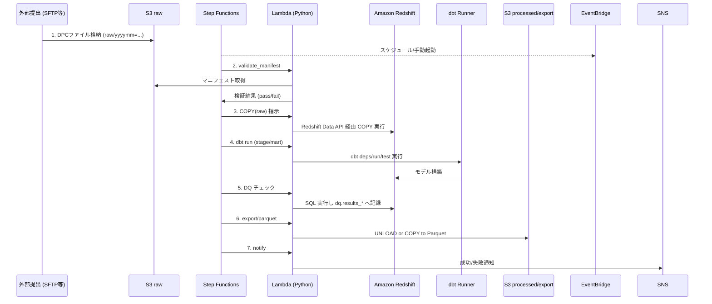

# DPC 学習基盤 全体アーキテクチャ設計（AWS）

## 目的
DPC データ学習基盤のコンポーネント構成、データフロー、およびセキュリティ境界を明確にし、関係者間の共通理解を形成する。

## 想定ユーザーとワークロード
- **データエンジニア**: DPC ファイルの取込・変換・公開ワークロードを実装・運用する。
- **アナリスト / 研究者**: mart 層を Redshift / QuickSight から参照し、統計分析と可視化を行う。
- **プラットフォーム管理者**: 権限管理、セキュリティ設定、運用監視を担当する。

## コンポーネント一覧と役割
| コンポーネント | 役割 |
| --- | --- |
| Amazon S3 (raw/stage/processed/archive) | DPC ファイルの受領、加工中間生成物、エクスポート成果の保管。層別バケットあるいは共通バケット配下のプレフィックスで管理。 |
| AWS Glue Data Catalog | Redshift 外部テーブル、S3 マニフェスト、QuickSight 連携のためのメタデータリポジトリ。 |
| Amazon Redshift (RA3, Concurrency Scaling) | DPC データの保存・変換・集計を行う DWH。raw/stage/mart/ref スキーマを配置。 |
| AWS Step Functions + Amazon EventBridge | バッチ ELT のオーケストレーションとスケジューリング。学習向けの定期・オンデマンド実行を制御。 |
| AWS Lambda (Python) | マニフェスト検証、Redshift Data API 呼出、dbt Runner 起動、エクスポート等の軽量ロジックを実装。 |
| dbt Cloud / dbt CLI | Redshift 内のデータモデル構築・テスト・ドキュメント生成。 |
| Amazon QuickSight (任意) | mart 層に基づく可視化ダッシュボード。学習用途の KPI モニタリングに活用。 |
| Amazon SNS / Slack Webhook (外部) | 実行結果・障害通知の配信。 |
| AWS KMS | S3、Redshift、Secrets Manager などの暗号鍵を提供。 |
| AWS Secrets Manager | Redshift / Slack 等の資格情報の安全な保管。 |

## システム構成図
```mermaid
flowchart TB
  subgraph VPC[Private VPC]
    subgraph SubnetA[Private Subnet (AZ-a)]
      rs[(Amazon Redshift RA3 Cluster)]
      lambdaA[(Lambda Functions)]
    end
    subgraph SubnetB[Private Subnet (AZ-b)]
      lambdaB[(Lambda Functions)]
    end
    sf[(AWS Step Functions)]
  end
  eb[(Amazon EventBridge Schedule)] --> sf
  sf --> lambdaA
  lambdaA -->|Redshift Data API (private link)| rs
  rs -->|Unload/Export| s3_processed[(S3 processed)]
  s3_raw[(S3 raw)] --> rs
  s3_raw --> lambdaA
  lambdaA --> glue[(AWS Glue Catalog)]
  rs --> qs[(Amazon QuickSight)]
  kms[(AWS KMS)] --> s3_raw
  kms --> rs
  kms --> secrets[(AWS Secrets Manager)]
  secrets --> lambdaA
  lambdaA --> sns[(SNS/Slack)]
```

## データフロー図


## コンポーネント詳細
- **S3 raw/stage/processed/archive**: バケット `dpc-learning-data-<env>` を想定。raw で受領、stage で中間成果（オプション）、processed でエクスポート、archive はライフサイクル移動先。
- **Redshift RA3**: RA3 4XL 以上を想定。Concurrency Scaling を有効化し、dbt 実行時のピーク負荷を吸収。Database 内に `raw`, `stage`, `mart`, `ref`, `dq` スキーマ。
- **Step Functions**: 標準ステートマシン。学習では 1 日 1 回スケジュール + 手動実行 API。
- **Lambda**: Python 3.11 ランタイム。Redshift Data API で SQL 実行、dbt CLI 起動（コンテナイメージ Lambda も可）。VPC 内実行、S3/VPC エンドポイント経由で通信。
- **dbt**: CodeCommit/GitHub からソース取得。Lambda 実行時にコンテナイメージへ組込み、`dbt run --select stage` などを実行。
- **QuickSight**: 学習オプションとして、mart 層のデータセットを SPICE にインポート。

## VPC・サブネット配置
| 項目 | 内容 |
| --- | --- |
| VPC CIDR | 10.20.0.0/16 |
| Private Subnet (AZ-a) | 10.20.1.0/24 – Redshift、Lambda (サブセット) |
| Private Subnet (AZ-b) | 10.20.2.0/24 – Lambda 冗長配置 |
| NAT Gateway | 1基 (AZ-a)。dbt 実行でのパッケージ取得等に利用。必要に応じて S3 / Redshift Data API の VPC エンドポイントを利用し、インターネット経路を最小化。 |
| VPC エンドポイント | S3 Gateway、Secrets Manager、Redshift Data API Interface、CloudWatch Logs Interface |
| セキュリティグループ | Redshift 用 (Lambda から 5439/TCP)、Lambda 用 (アウトバウンド制限) |

## IAM ロール一覧
| ロール名 | 利用主体 | 付与ポリシー概要 |
| --- | --- | --- |
| `role-lambda-dpc` | Lambda 関数 | S3 raw/stage 読書、Redshift Data API 実行、Secrets Manager 取得、CloudWatch Logs 出力。 |
| `role-redshift-copy` | Redshift Spectrum/COPY | S3 raw 読取、KMS decrypt。COPY/UNLOAD 時に一時クレデンシャルを利用。 |
| `role-stepfunctions-dpc` | Step Functions | Lambda Invoke、SNS Publish、EventBridge 起動連携。 |
| `role-quicksight-dpc` | QuickSight | Redshift 読取、Glue Catalog 参照。 |
| `role-dbt-runner` | dbt 実行環境 | Redshift SQL 実行、S3 ログ出力。 |

## KMS 鍵設計
- **CMK 名称**: `alias/dpc-learning-kms`
- **用途**: S3 サーバーサイド暗号化 (SSE-KMS)、Redshift 暗号化、Secrets Manager シークレット暗号化。
- **キーポリシー**: セキュリティ管理者をキー管理者、Lambda / Redshift / S3 サービスロールをキーユーザーとして登録。

## セキュリティ境界
- すべてのワークロードをプライベートサブネット内で完結させ、Public Subnet・パブリックエンドポイントは使用しない。
- 外部とのインタフェースは S3 へのファイル投入と SNS/Slack 通知のみ。S3 へのアップロードは既存の SFTP → S3 転送（別アカウント）を想定し、本アカウントでは受領バケットのみ管理する。
- ネットワークアクセスは必要最小限のセキュリティグループ / NACL で制限。

## 運用ポイント
- EventBridge で本番・学習環境それぞれスケジュール管理。
- Step Functions の実行ログを CloudWatch Logs に出力し、障害時のトレースを容易にする。
- dbt モデル更新は CI/CD パイプライン経由で適用、手動変更は禁止。
- Redshift ワークロードは WLM で制御し、学習者のアドホッククエリは専用キューに割当てる。

## 決定事項 / 未決事項
- **決定事項**
  - DPC データは S3 raw プレフィックス経由で受領し、Step Functions から Lambda → Redshift Data API → dbt の流れで処理する。
  - すべてのリソースはプライベートサブネット内に配置し、S3/GW エンドポイントと NAT Gateway を併用する。
  - KMS カスタマー管理キー `alias/dpc-learning-kms` を S3・Redshift・Secrets Manager で共通利用する。
- **未決事項**
  - 学習環境における QuickSight 導入範囲（利用部門、SPICE 容量）が未定。
  - Lambda の dbt 実行方式（ZIP + Layer vs. コンテナイメージ）の最終決定が必要。
  - 外部からの DPC ファイル投入方法（SFTP 連携 or 直接 S3）について追加調整が必要。
