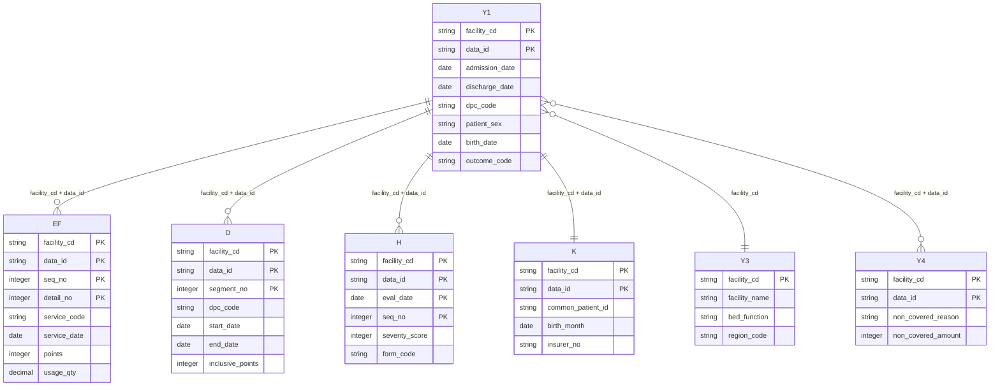

# DPC 学習基盤 論理データモデル（ERD）

## モデル概要
DPC データの 7 ファイル（様式1/3/4、EF、D、H、K）の論理的なエンティティ関係を定義し、主キー・外部キーおよび多重度を明確化する。

## Mermaid ERD

## キー定義表
| テーブル | 主キー | 外部キー | 多重度 | 備考 |
| --- | --- | --- | --- | --- |
| 様式1 (Y1) | `facility_cd`, `data_id` | `facility_cd` → 様式3 | 1 (主体) | 入退院、DPC コードなど症例中心情報。 |
| 様式3 (Y3) | `facility_cd` | なし | 1 ↔ 多 (Y1, Y4, EF, D, H, K) | 病院属性ディメンション。 |
| 様式4 (Y4) | `facility_cd`, `data_id` | `(facility_cd, data_id)` → 様式1 | 0..1 ↔ 0..1 | 非保険症例を示す補助データ。 |
| EF (E/F 統合) | `facility_cd`, `data_id`, `seq_no`, `detail_no` | `(facility_cd, data_id)` → 様式1 | 1 (Y1) ↔ 多 (EF) | 診療明細 (親:症例、子:明細)。 |
| D | `facility_cd`, `data_id`, `segment_no` | `(facility_cd, data_id)` → 様式1 | 1 ↔ 多 | 包括点数明細。segment_no は出来高理由等で複数行。 |
| H | `facility_cd`, `data_id`, `eval_date`, `seq_no` | `(facility_cd, data_id)` → 様式1 | 1 ↔ 多 | 日次重症度評価。eval_date ごとに複数項目。 |
| K | `facility_cd`, `data_id` | `(facility_cd, data_id)` → 様式1 | 1 ↔ 1 | 症例ごとの共通患者 ID。 |

## 補足説明
- 様式1 を中心に各明細テーブルがぶら下がるスター型の論理構造を採用。主要な結合キーは `facility_cd + data_id`。
- 様式4 は非保険症例のみ出力されるため、様式1 との関係は 0..1 対 0..1。実装では LEFT JOIN でフラグ化する想定。
- K ファイルは 2020 年度以降の共通 ID を保持し、同一患者の再入院分析に使用。Y1 と 1:1。
- EF テーブルは E/F 統合を前提としたため、行単位でユニークになる `seq_no`（親）と `detail_no`（子）を含め主キーとする。
- H テーブルは評価日・評価票番号ごとに複数行を保持するため `eval_date + seq_no` を主キーに含める。

## 決定事項 / 未決事項
- **決定事項**
  - すべての明細テーブルは `facility_cd + data_id` を共通外部キーとし、様式1 を中心とする論理スター構造を採用する。
  - 共通患者 ID (K) は様式1 と 1:1 として管理し、患者ディメンション生成時に必須参照とする。
  - EF の主キーは `(facility_cd, data_id, seq_no, detail_no)` とし、seq/detail の欠落はデータ品質ルールで検出する。
- **未決事項**
  - 施設コードのマスタ（様式3）に地域・機能区分をどこまで保持するか詳細設計が必要。
  - 様式4 の非保険金額を別テーブルに正規化するか、Y4 に保持したままにするか要検討。
  - K ファイルの共通 ID に関する変換（ハッシュアルゴリズム等）の補足情報をどこまで保持するか未定。
