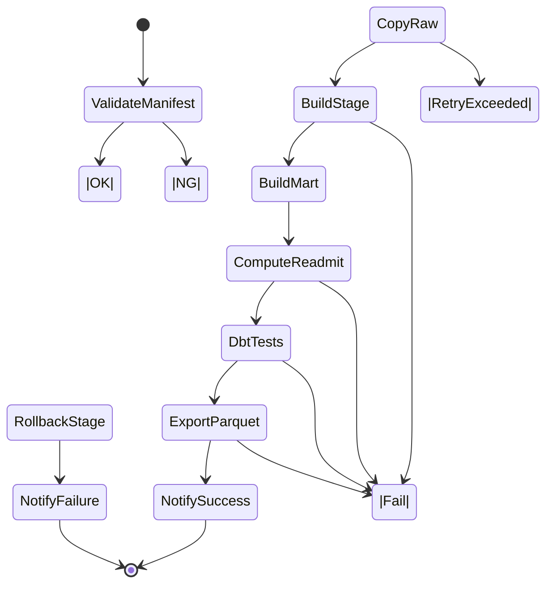

# DPC 学習基盤 ELT パイプライン設計（Step Functions + dbt + Python）

## 目的
EventBridge でトリガーされるバッチパイプラインのフロー、各ステップの入出力、リトライおよび再実行性方針を定義する。

## 全体フロー概要
1. EventBridge が日次スケジュール（例: JST 03:00）で Step Functions ステートマシンを起動。
2. `validate_manifest` Lambda が S3 raw 配下の `_manifest.json` を検証。
3. `COPY_raw` Lambda が Redshift Data API で `COPY` を実行し raw スキーマへロード。
4. `build_stage` Lambda が dbt Runner を呼び出し `dbt run --select stage` を実行。
5. `build_mart` Lambda が `dbt run --select mart` を実行。
6. `compute_readmit` Lambda が再入院ロジック SQL を実行し結果を mart に反映。
7. `dbt tests` Lambda が `dbt test` を実行。
8. `export_parquet` Lambda が `UNLOAD` で mart から Parquet を S3 processed へ出力。
9. `notify` Lambda が結果を SNS/Slack へ通知。

## アクティビティ図


## Step Functions ASL (JSON 雛形)
```json
{
  "Comment": "DPC Learning ELT Pipeline",
  "StartAt": "ValidateManifest",
  "States": {
    "ValidateManifest": {
      "Type": "Task",
      "Resource": "arn:aws:states:::lambda:invoke",
      "OutputPath": "$.Payload",
      "Parameters": {
        "FunctionName": "arn:aws:lambda:ap-northeast-1:<account>:function:dpc-validate-manifest",
        "Payload.$": "$"
      },
      "Retry": [
        {
          "ErrorEquals": ["Lambda.ServiceException", "Lambda.AWSLambdaException", "Lambda.SdkClientException"],
          "IntervalSeconds": 10,
          "MaxAttempts": 3,
          "BackoffRate": 2
        }
      ],
      "Catch": [
        {
          "ErrorEquals": ["States.ALL"],
          "Next": "NotifyFailure"
        }
      ],
      "Next": "CopyRaw"
    },
    "CopyRaw": {
      "Type": "Task",
      "Resource": "arn:aws:states:::lambda:invoke",
      "OutputPath": "$.Payload",
      "Parameters": {
        "FunctionName": "arn:aws:lambda:ap-northeast-1:<account>:function:dpc-copy-raw",
        "Payload.$": "$"
      },
      "Retry": [
        {
          "ErrorEquals": ["ThrottlingException", "RedshiftData.Exception"],
          "IntervalSeconds": 30,
          "MaxAttempts": 4,
          "BackoffRate": 2
        }
      ],
      "Catch": [
        {
          "ErrorEquals": ["States.ALL"],
          "Next": "NotifyFailure"
        }
      ],
      "Next": "BuildStage"
    },
    "BuildStage": {
      "Type": "Task",
      "Resource": "arn:aws:states:::lambda:invoke",
      "OutputPath": "$.Payload",
      "Parameters": {
        "FunctionName": "arn:aws:lambda:ap-northeast-1:<account>:function:dpc-dbt-stage",
        "Payload": {
          "command": "dbt run --select stage",
          "target_yyyymm.$": "$.yyyymm"
        }
      },
      "Catch": [
        {
          "ErrorEquals": ["States.ALL"],
          "ResultPath": "$.error",
          "Next": "RollbackStage"
        }
      ],
      "Next": "BuildMart"
    },
    "RollbackStage": {
      "Type": "Task",
      "Resource": "arn:aws:states:::lambda:invoke",
      "Parameters": {
        "FunctionName": "arn:aws:lambda:ap-northeast-1:<account>:function:dpc-rollback",
        "Payload": {
          "schema": "stage",
          "yyyymm.$": "$.yyyymm"
        }
      },
      "End": true
    },
    "BuildMart": {
      "Type": "Task",
      "Resource": "arn:aws:states:::lambda:invoke",
      "OutputPath": "$.Payload",
      "Parameters": {
        "FunctionName": "arn:aws:lambda:ap-northeast-1:<account>:function:dpc-dbt-mart",
        "Payload": {
          "command": "dbt run --select mart",
          "target_yyyymm.$": "$.yyyymm"
        }
      },
      "Catch": [
        {
          "ErrorEquals": ["States.ALL"],
          "Next": "NotifyFailure"
        }
      ],
      "Next": "ComputeReadmit"
    },
    "ComputeReadmit": {
      "Type": "Task",
      "Resource": "arn:aws:states:::lambda:invoke",
      "OutputPath": "$.Payload",
      "Parameters": {
        "FunctionName": "arn:aws:lambda:ap-northeast-1:<account>:function:dpc-compute-readmit",
        "Payload.$": "$"
      },
      "Catch": [
        {
          "ErrorEquals": ["States.ALL"],
          "Next": "NotifyFailure"
        }
      ],
      "Next": "DbtTests"
    },
    "DbtTests": {
      "Type": "Task",
      "Resource": "arn:aws:states:::lambda:invoke",
      "OutputPath": "$.Payload",
      "Parameters": {
        "FunctionName": "arn:aws:lambda:ap-northeast-1:<account>:function:dpc-dbt-tests",
        "Payload": {
          "command": "dbt test",
          "selectors": ["stage", "mart"]
        }
      },
      "Catch": [
        {
          "ErrorEquals": ["States.ALL"],
          "Next": "NotifyFailure"
        }
      ],
      "Next": "ExportParquet"
    },
    "ExportParquet": {
      "Type": "Task",
      "Resource": "arn:aws:states:::lambda:invoke",
      "OutputPath": "$.Payload",
      "Parameters": {
        "FunctionName": "arn:aws:lambda:ap-northeast-1:<account>:function:dpc-export-parquet",
        "Payload": {
          "target": "s3://dpc-learning-data-<env>/processed/yyyymm=$.yyyymm"
        }
      },
      "Catch": [
        {
          "ErrorEquals": ["States.ALL"],
          "Next": "NotifyFailure"
        }
      ],
      "Next": "NotifySuccess"
    },
    "NotifySuccess": {
      "Type": "Task",
      "Resource": "arn:aws:states:::lambda:invoke",
      "Parameters": {
        "FunctionName": "arn:aws:lambda:ap-northeast-1:<account>:function:dpc-notify",
        "Payload": {
          "status": "SUCCESS",
          "yyyymm.$": "$.yyyymm"
        }
      },
      "End": true
    },
    "NotifyFailure": {
      "Type": "Task",
      "Resource": "arn:aws:states:::lambda:invoke",
      "Parameters": {
        "FunctionName": "arn:aws:lambda:ap-northeast-1:<account>:function:dpc-notify",
        "Payload": {
          "status": "FAILURE",
          "detail.$": "$"
        }
      },
      "End": true
    }
  }
}
```

## Lambda 入力パラメータ
| 関数 | 入力例 | 主な処理 |
| --- | --- | --- |
| `dpc-validate-manifest` | `{ "yyyymm": "202504", "facility_cd": "131000123" }` | `_manifest.json` 読込、JSON Schema 検証、ハッシュチェック。 |
| `dpc-copy-raw` | `{ "yyyymm": "202504", "file_types": ["y1", "ef_in", "d"] }` | `COPY raw.<table>` をファイルタイプごとに実行。 |
| `dpc-dbt-stage` | `{ "command": "dbt run --select stage", "target_yyyymm": "202504" }` | dbt CLI 実行、ログを CloudWatch 出力。 |
| `dpc-dbt-mart` | `{ "command": "dbt run --select mart", "target_yyyymm": "202504" }` | mart モデル構築。 |
| `dpc-compute-readmit` | `{ "yyyymm": "202504" }` | 再入院計算 SQL を実行（例: ウィンドウ関数で 7/30 日判定）。 |
| `dpc-dbt-tests` | `{ "command": "dbt test", "selectors": ["stage", "mart"] }` | dbt テスト実行。 |
| `dpc-export-parquet` | `{ "target": "s3://dpc-learning-data-dev/processed/yyyymm=2025-04" }` | `UNLOAD` で Parquet 出力し manifest を生成。 |
| `dpc-notify` | `{ "status": "SUCCESS", "yyyymm": "202504" }` | SNS/Slack 通知。 |

## dbt コマンド
1. `dbt deps`
2. `dbt seed --select ref.icd10_master`
3. `dbt run --select stage` (incremental)
4. `dbt run --select mart`
5. `dbt run --select ref`（必要時）
6. `dbt test --select stage mart`
7. `dbt docs generate`

## エラーハンドリングと再実行性
- Step Functions 各ステップに `Retry` と `Catch` を実装し、AWS 標準エラーを指数バックオフ。
- `validate_manifest` 失敗時は `NotifyFailure` へ遷移し、次回実行で再検証。マニフェスト修正後に手動再実行可能。
- `COPY` 途中失敗時は Redshift の `stl_load_errors` を参照し、Lambda ログにエラー詳細を出力。再実行前に `DELETE FROM raw.<table> WHERE yyyymm=?` を行い冪等性確保。
- dbt の失敗時は `RollbackStage`（例: 該当 yyyymm の stage テーブル削除）を実施し再実行に備える。
- `compute_readmit` は `DELETE FROM mart.fact_case_summary WHERE yyyymm=?` → 再計算で冪等。
- `export_parquet` は S3 `processed/yyyymm=` プレフィックスを `s3:DeleteObjects` でクリアしてから `UNLOAD`。

## 通知戦略
- `dpc-notify` Lambda が Slack Webhook にメッセージ送信。
- 成功時: 件数・処理時間を表示。
- 失敗時: ステップ名、エラータイプ、CloudWatch Log グループ URL。

## 決定事項 / 未決事項
- **決定事項**
  - Step Functions を中心に、Lambda + Redshift Data API + dbt で ELT を実行する。
  - 冪等性のために各ステップは対象年月の削除→再ロードを実施する。
  - 通知は SNS/Slack を統一し、成功・失敗どちらも発報する。
- **未決事項**
  - `RollbackStage` の具体的な処理（TRUNCATE 対象テーブル範囲）を確定する必要がある。
  - `compute_readmit` の SQL 実装方式（Lambda 内 SQL vs dbt model）を最終決定する必要がある。
  - `export_parquet` の圧縮形式（Snappy vs gzip）とパーティション方式について追加検討が必要。
