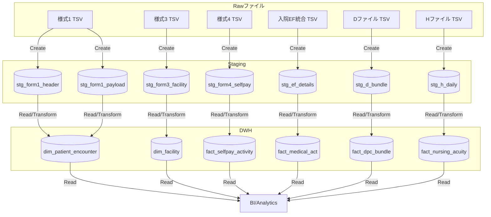

# DPC提出データ変換フロー概要

本ドキュメントでは、[docs/14_table_definitions.md](./14_table_definitions.md) に記載された2025年度DPC提出データを基に、データレイク/データウェアハウスでのデータ変換に必要なCRUDフローとELTフローを整理します。DPC提出データはタブ区切り（KファイルのみCSV）で提供されるため、ステージング層でのフォーマット正規化と、各テーブル定義に沿ったロード手順が前提となります。

## 1. CRUD観点でのデータ処理責務

DPCデータの取扱いは主にバッチ処理で行われ、`Create`と`Read`が中心です。`Update`と`Delete`は、法定訂正や再提出が必要な場合に限定されます。以下の表は、主要テーブルに対するCRUD操作の責務を整理したものです。

| テーブル/ファイル | Create | Read | Update | Delete | 備考 |
| --- | --- | --- | --- | --- | --- |
| 様式1ヘッダ/ペイロード (A-1/A-2) | 新規入院レコードをステージング層に取り込む | 分析用DWH/マートから参照 | 訂正依頼に基づく個別更新 (匿名ID単位) | 訂正に伴う旧レコードの論理削除 | レコード識別キーは施設コード等の複合キー |
| 様式3 (B) | 月次施設情報をロード | 医療機関属性分析 | 月次更新時の差分反映 | 旧月の履歴保持 (論理削除なし) | 月次スナップショット管理 |
| 様式4 (C) | 自費等の診療情報をロード | 包括評価時に参照 | 再提出時の差分更新 | 履歴保持 | 匿名ID＋入院日＋退院日がキー |
| 入院EF統合 (D) | 診療・行為明細を日次・行為単位でロード | 診療実績分析、出来高検証 | 再提出時の差分更新 | 訂正元レコードを論理削除 | 順序番号・行為明細番号でユニーク化 |
| Dファイル (E) | 包括点数・出来高理由をロード | 包括評価、係数算定 | 再提出時の差分更新 | 訂正元レコードを論理削除 | データ区分＋レセプト電算コードで明細特定 |
| Hファイル (F-1/F-2) | 看護必要度評価を日次でロード | 看護必要度評価指標算出 | 再提出時の差分更新 | 訂正元レコードを論理削除 | 病棟コード＋実施日で粒度管理 |

### CRUDダイアグラム



図中では、`Create`操作が原データファイルからステージングテーブルへのロードを表し、`Read/Transform`はステージングデータを用いてDWHスキーマへ集約・整形する処理を表しています。`Update`/`Delete`は再提出時にステージングテーブルで論理削除フラグをセットし、DWH側でSCD（ゆっくり変化する次元）またはスナップショットとして扱う運用を想定します。

## 2. ELTプロセスの全体像

### 2.1 パイプラインレイヤー

1. **Extract (E)**: 医療機関から提供される各ファイル（様式1～Hファイル）を、セキュアストレージに受領し、ファイルメタ情報（年度、施設コード、ファイル種別、作成日）をカタログ化。
2. **Load (L)**: 受領したファイルをそのままステージングスキーマにロード。TSV/CSVの整形（文字コード、空欄→NULL変換、桁数チェック）を実施。
3. **Transform (T)**: dbt等の変換ジョブで、ステージングからDWHスキーマへ変換。主な処理は以下の通り。
   - 様式1ヘッダ/ペイロードを結合し、患者属性・転帰・診断情報を統合。
   - 様式3から施設ディメンションを作成し、月次属性を保持。
   - 様式4を利用し、自費・他制度併用の指標を付与。
   - 入院EF統合、Dファイル、Hファイルをファクトテーブルとして集約し、匿名IDや病棟コードで粒度を揃える。
   - バージョン情報（バージョン日、算定期間など）をサロゲートキー化し、変更履歴を追跡可能にする。

### 2.2 ELTダイアグラム

```mermaid
graph LR
    subgraph Extract
        R1[原データ受領\n(SFTP/共有ストレージ)]
    end
    subgraph Load
        L1[フォーマット正規化スクリプト]
        L2[(Staging Schema)]
    end
    subgraph Transform
        T1[品質検証\n(桁数・Nullチェック)]
        T2[dbtモデル\n(結合・集約・履歴管理)]
        T3[(DWH/マート)]
        T4[BI/レポート]
    end

    R1 -->|TSV/CSV Import| L1 -->|Copy Into| L2
    L2 -->|Validation| T1 -->|Pass| T2 -->|Materialize| T3 -->|Read| T4
    T1 -.Failed Rows.-> FR[監査リジェクトテーブル]
```

Transform層では、`T1`でテーブル定義の桁数・必須項目ルール（例: 施設コード9桁、データ識別番号10桁、入退院年月日8桁など）を基に品質検証を行います。検証エラーは監査テーブルに記録し、再提出ワークフローへ連携します。`T2`では、匿名IDをキーとしたファクト/ディメンションの構築、行為明細の粒度統一、医療機関別係数の計算などを実施します。

## 3. 変換ジョブ設計上の留意事項

- **主キー管理**: 様式1は複合キー、入院EF統合やDファイルは順序番号・行為明細番号でユニーク化する必要があります。
- **日付の扱い**: 入退院年月日や実施年月日が「00000000」の場合は未退院扱いとしてNULL変換するルールを定義します。
- **バージョン/算定期間**: バージョンコード（例: 20240601）は施行日を示すため、変換後も保持しSCD管理に活用します。算定開始日/終了日が設定されている場合は期間テーブルに展開します。
- **論理削除と再提出**: 訂正データは匿名ID＋順序番号などのキーで既存データを論理削除し、差し替えレコードを追加する設計とします。
- **監査ログ**: ロード時・変換時のレコード件数、エラー件数、実施日時を監査テーブルに残し、提出差戻しや監査対応に備えます。

以上の設計により、docs/14_table_definitions.mdで定義されている各種ファイルの構造を維持しながら、データレイクからDWH/BIまで一貫したデータ品質とトレーサビリティを確保できます。
